# The Aerial Guardian Challenge

**Lightweight person detection and multi-object tracking for VisDrone aerial video**

Repository: [github.com/rishi02102017/The-Aerial-Guardian-Challenge](https://github.com/rishi02102017/The-Aerial-Guardian-Challenge)

---

## 1. Problem Statement

Drone-mounted cameras introduce vision challenges that differ from ground surveillance:

- **Small targets:** persons often occupy fewer than 32×32 pixels.
- **Ego-motion:** platform translation and rotation shift the background globally.
- **Scale diversity:** altitude and gimbal angle change apparent object size within a clip.

This project implements an end-to-end **detect-and-track** pipeline on the [VisDrone2019 MOT validation set](https://github.com/VisDrone/VisDrone-Dataset), restricted to **person** categories (VisDrone IDs 1: pedestrian, 2: person), under a **300 MB** deployable model budget.

---

## 2. System Architecture

### 2.1 High-level design

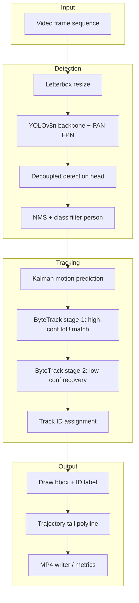

### 2.2 Component responsibilities

| Layer | Technology | Role |
|-------|------------|------|
| Detector | YOLOv8n (fine-tuned) | Person proposals at multi-scale FPN levels |
| Tracker | ByteTrack | Temporal ID consistency without ReID embeddings |
| Visualizer | OpenCV | Bounding boxes, `ID:k` labels, 25-frame trails |
| Config | YAML | Thresholds, resolution, tracker buffers |

### 2.3 Repository layout

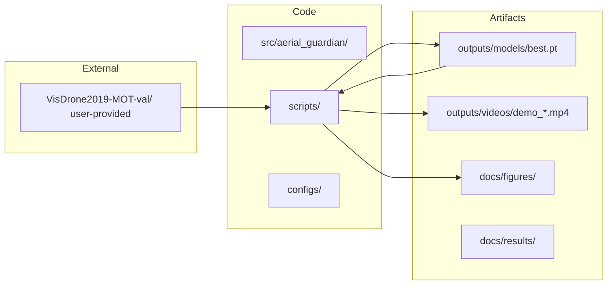

---

## 3. Method Summary

### 3.1 YOLOv8n detector

YOLOv8n uses a **CSPDarknet** backbone and **PAN-FPN** neck. The decoupled head predicts, at three strides:

1. Box offsets via distribution focal loss (DFL).
2. Class probability (single `person` class after fine-tuning).
3. Objectness for ranking before NMS.

**Adaptations beyond COCO-pretrained weights:**

| Adaptation | Rationale |
|------------|-----------|
| VisDrone person-only fine-tune | Domain shift: altitude, viewpoint, clutter |
| Training resolution 1280 px | Higher feature map resolution for micro-targets |
| Inference resolution 960 px | Latency/recall trade-off on RTX A4000 |
| conf = 0.15 | Retain low-score boxes for ByteTrack second stage |
| Mosaic, mixup, copy-paste | Robustness; no vertical flip (aerial prior) |

### 3.2 ByteTrack association

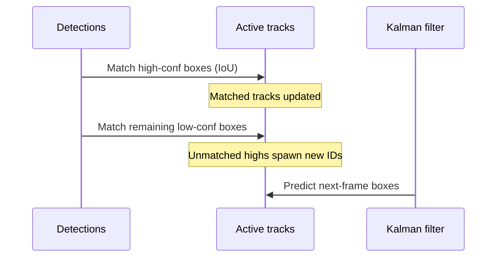

Parameters: `track_buffer=45`, `match_thresh=0.8`, `track_high_thresh=0.25` ([`configs/bytetrack_aerial.yaml`](configs/bytetrack_aerial.yaml)).

### 3.3 Optional tiled inference

[`src/aerial_guardian/tiled_detect.py`](src/aerial_guardian/tiled_detect.py) runs overlapping 640 px windows with merge-NMS. Disabled in default benchmarks; enable in config for maximum small-object recall.

---

## 4. Dataset and Splits

Place the assignment archive at:

```
VisDrone2019-MOT-val/
  sequences/<sequence_id>/*.jpg
  annotations/<sequence_id>.txt
```

| Split | Sequences | Frames (images) |
|-------|-----------|-----------------|
| Train (fine-tune) | 5 | 2,387 |
| Validation (metrics) | 2 | 459 |
| **Total** | **7** | **2,846** |

Validation instances (person): **6,086** boxes on held-out sequences `uav0000305_00000_v`, `uav0000339_00001_v`.

---

## 5. Experimental Results

### 5.1 Detection (held-out validation)

| Metric | Best checkpoint (epoch 1) |
|--------|---------------------------|
| Precision | 0.619 |
| Recall | 0.418 |
| mAP@0.5 | **0.488** |
| mAP@0.5:0.95 | **0.184** |

Training ran 16 epochs (early stopping, patience 15). Full per-epoch log: [`docs/results/training_metrics.csv`](docs/results/training_metrics.csv).

### 5.2 Training and validation curves

| Figure | Description |
|--------|-------------|
| 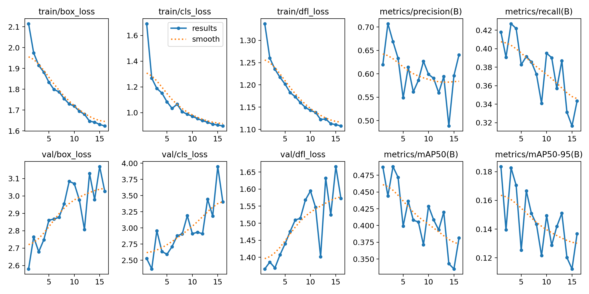 | Loss and mAP curves |
| 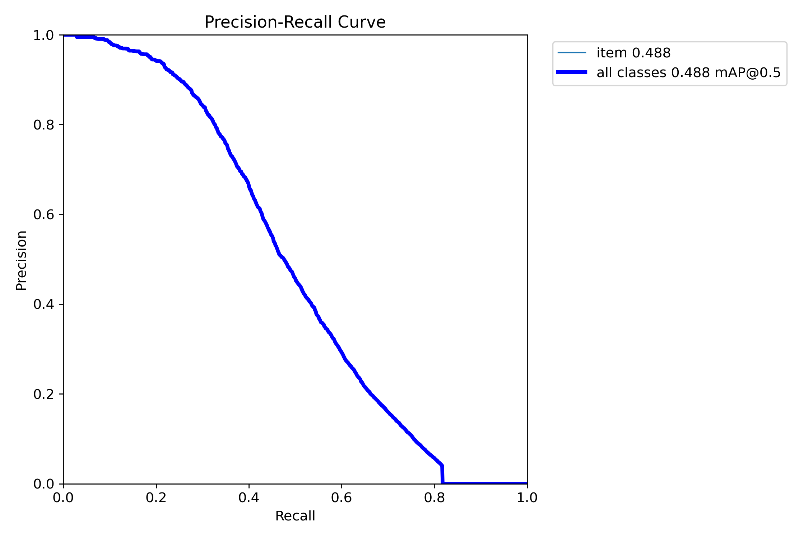 | Precision-recall |
| 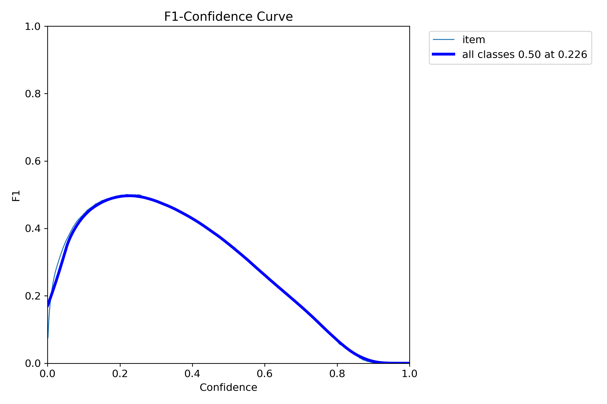 | F1 vs confidence |
| 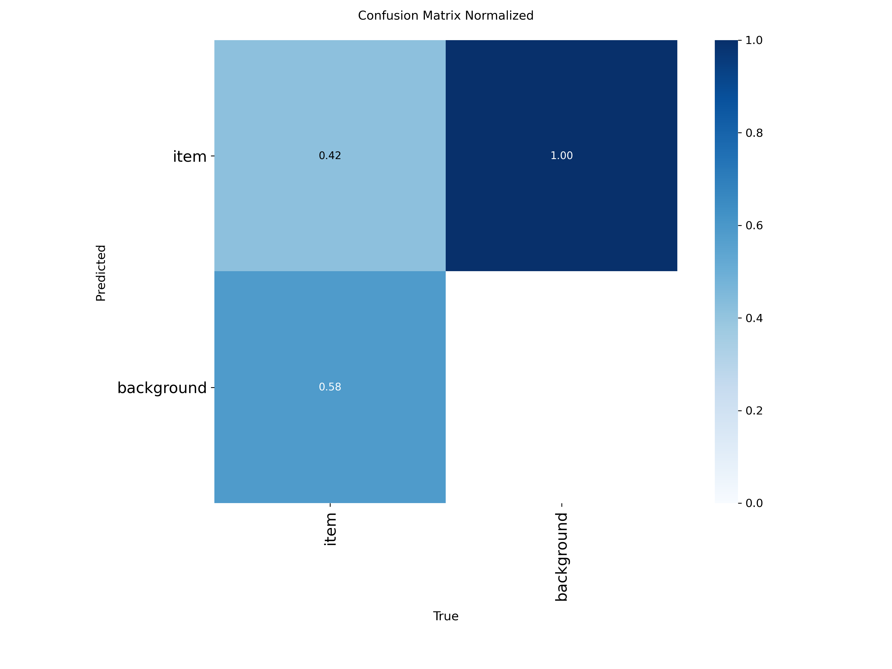 | Normalized confusion matrix |

### 5.3 Qualitative detection

| Labels (GT) | Predictions |
|-------------|-------------|
| 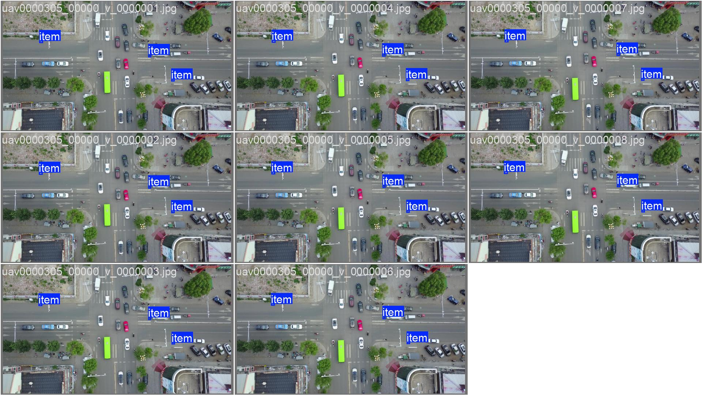 | 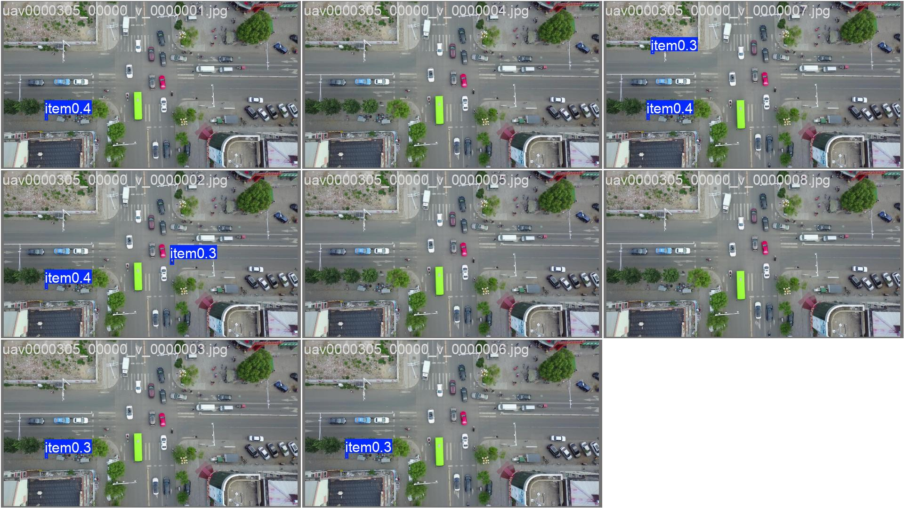 |

Label spatial distribution and training mosaic:

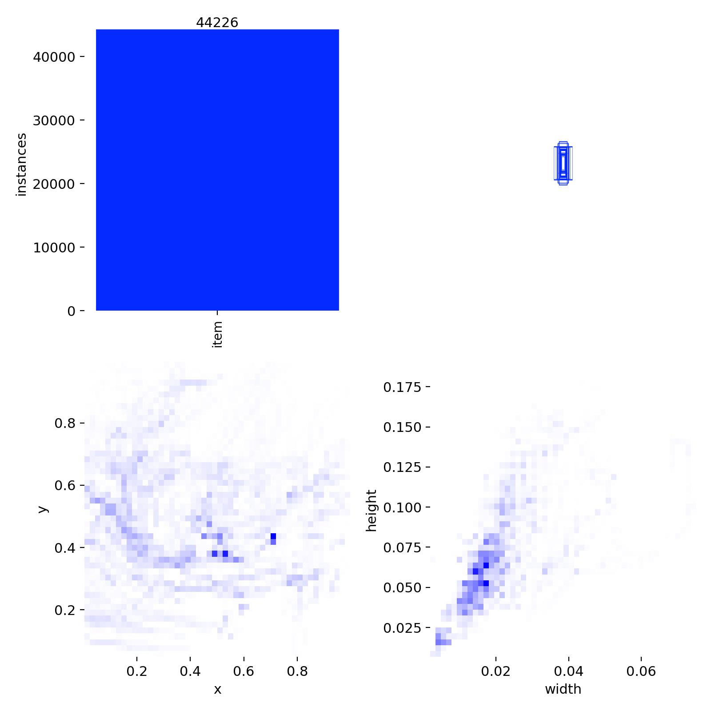

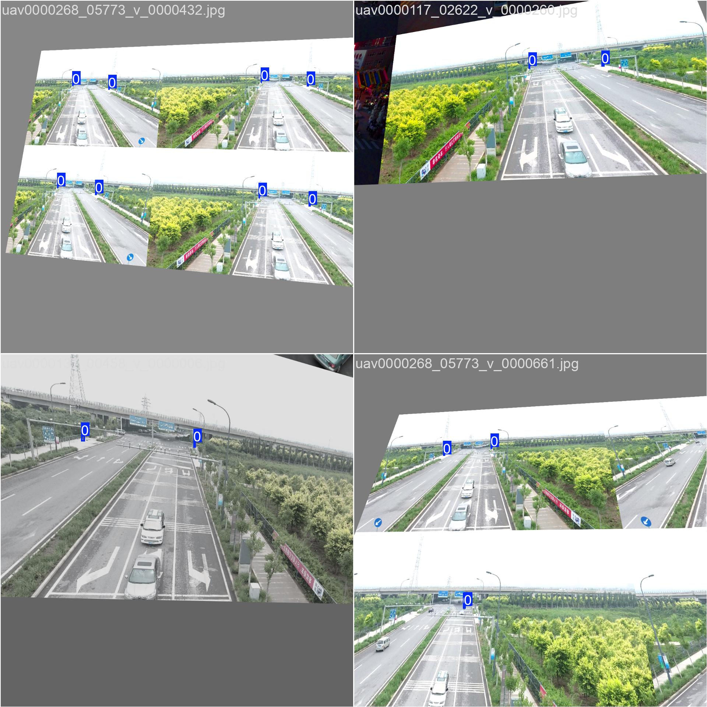

### 5.4 Tracking demo

| Item | Value |
|------|-------|
| Sequence | `uav0000086_00000_v` |
| Frames | 464 |
| Output | [`outputs/videos/demo_uav0000086.mp4`](outputs/videos/demo_uav0000086.mp4) |
| Overlay | Bounding box, `ID:k`, confidence, 25-frame trail |

Demo throughput (includes video encoding): **159.4 FPS** — [`docs/results/demo_stats.json`](docs/results/demo_stats.json).

### 5.5 End-to-end latency (detect + track)

Measured on **NVIDIA RTX A4000 #0**, FP16, `imgsz=960`, ByteTrack, 200 frames after 30-frame warmup:

| Metric | Value |
|--------|-------|
| Mean latency | 5.24 ms / frame |
| **Throughput** | **190.7 FPS** |
| Model size | 6.1 MB (`outputs/models/best.pt`) |
| Train resolution | 1280 px |

Full JSON: [`docs/results/fps_report.json`](docs/results/fps_report.json).

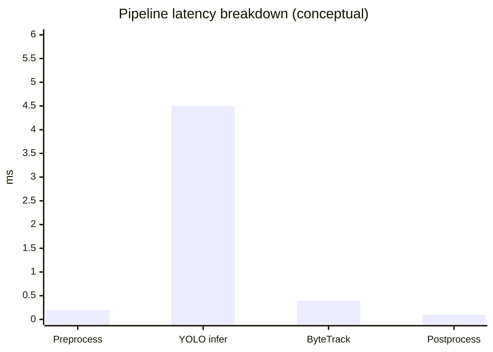

*Note: Ultralytics validation reported 2.4 ms inference-only per image at batch val; end-to-end track loop measured 5.24 ms including association.*

### 5.6 Hardware

| Component | Specification |
|-----------|---------------|
| GPU | 2× NVIDIA RTX A4000 (16 GB) |
| Driver | 550.107.02 |
| OS | Linux 6.9.1 x86_64 |
| Python | 3.11.7 |
| PyTorch | 2.5.1+cu121 |

---

## 6. Engineering Trade-offs

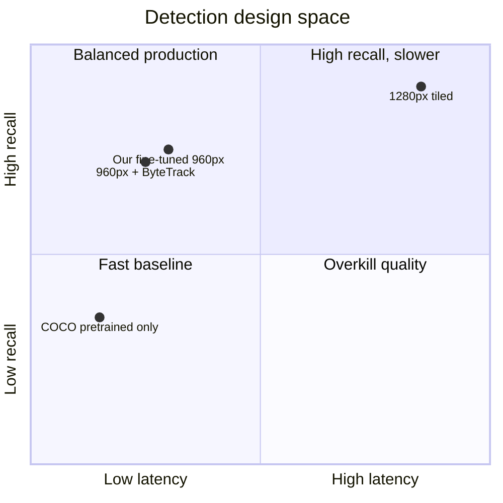

| Decision | Benefit | Cost |
|----------|---------|------|
| YOLOv8n vs larger variants | 6 MB, >150 FPS | Lower absolute mAP than YOLOv8s/m |
| ByteTrack vs DeepSORT | No ReID model or embedding FPS hit | More ID switches in dense crowds |
| 1280 train / 960 infer | Small-target learning + real-time infer | Train/infer resolution gap |
| 5+2 sequence split | Enables fine-tune without separate train zip | Limited val sequences for metrics |

---

## 7. Edge Deployment (NVIDIA Jetson)

1. Export: `yolo export model=outputs/models/best.pt format=onnx`
2. Build TensorRT FP16 engine (Orin NX / AGX).
3. Run inference at **640–736 px**; keep ByteTrack on CPU.
4. Disable tiled inference on-device.
5. Optional: async GStreamer capture + inference threads.

Expected: real-time on Orin NX at 640 px; 960 px likely requires AGX or clock boost. On-silicon FPS not measured in this submission.

---

## 8. Installation and Reproduction

### 8.1 Environment

```bash
git clone https://github.com/rishi02102017/The-Aerial-Guardian-Challenge.git
cd The-Aerial-Guardian-Challenge
python3 -m venv .venv && source .venv/bin/activate
pip install torch torchvision --index-url https://download.pytorch.org/whl/cu121
pip install -r requirements.txt
```

### 8.2 Dataset

Download [VisDrone2019-MOT-val](https://github.com/VisDrone/VisDrone-Dataset) and extract to `VisDrone2019-MOT-val/`.

### 8.3 Commands

```bash
# Convert annotations to YOLO format
python scripts/prepare_dataset.py

# Fine-tune (GPU required)
CUDA_VISIBLE_DEVICES=0 python scripts/train.py

# Demo video
CUDA_VISIBLE_DEVICES=0 python scripts/run_demo.py \
  --seq uav0000086_00000_v \
  --output outputs/videos/demo_uav0000086.mp4

# FPS benchmark
CUDA_VISIBLE_DEVICES=0 python scripts/benchmark_fps.py
```

## 9. Deliverables Checklist

| Requirement | Location |
|-------------|----------|
| Source code | `src/`, `scripts/`, `configs/` |
| Setup instructions | This README |
| Fine-tuned weights | `outputs/models/best.pt` |
| Output video | `outputs/videos/demo_uav0000086.mp4` |
| Results and figures | `docs/figures/`, `docs/results/` |
| FPS + hardware | Section 5.5, `docs/results/fps_report.json` |

---

## 10. License and Acknowledgments

- **VisDrone Dataset:** see [VisDrone/VisDrone-Dataset](https://github.com/VisDrone/VisDrone-Dataset).
- **Ultralytics YOLO:** AGPL-3.0.
- **Assignment:** Aerial Guardian Challenge.

---

## 11. References

1. Zhu, P., et al. VisDrone-DET2019 Challenge. ICPR Workshops, 2019.
2. Zhang, Y., et al. ByteTrack. ECCV, 2022.
3. Ultralytics YOLOv8 Documentation: https://docs.ultralytics.com
